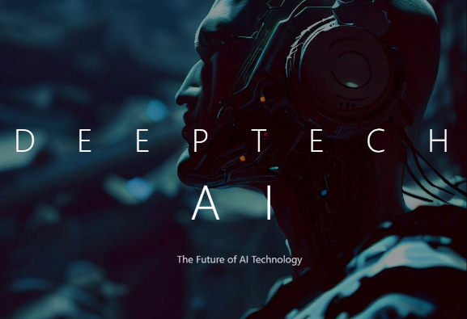

# DeepTech AI

## Overview

DeepTech AI is a pioneering technology company focused on developing cutting-edge AI solutions. Our platform combines advanced artificial intelligence with practical applications in streaming, content creation, and digital interaction.

## Core Products

### 🎮 Streamy
- AI-powered live streaming platform
- Advanced avatar technology
- Real-time interactions
- Ultra-low latency streaming
- AI-powered chat moderation

### 🎨 Medusa.io
- Creative AI suite
- Text-to-Image Generation
- Image-to-Video Transformation
- Smart Prompt Generation

### 🎭 Narrative AI
- Web-based AI application
- Image generation and animation
- Voice integration
- Interactive storytelling

## Connect With Us

- [@io2Medusa](https://x.com/io2Medusa) - Twitter
- [@JusChadneo](https://x.com/JusChadneo) - Twitter
- [neoKode1](https://github.com/neoKode1) - GitHub

## License

© 2024 DeepTech AI. All rights reserved.
